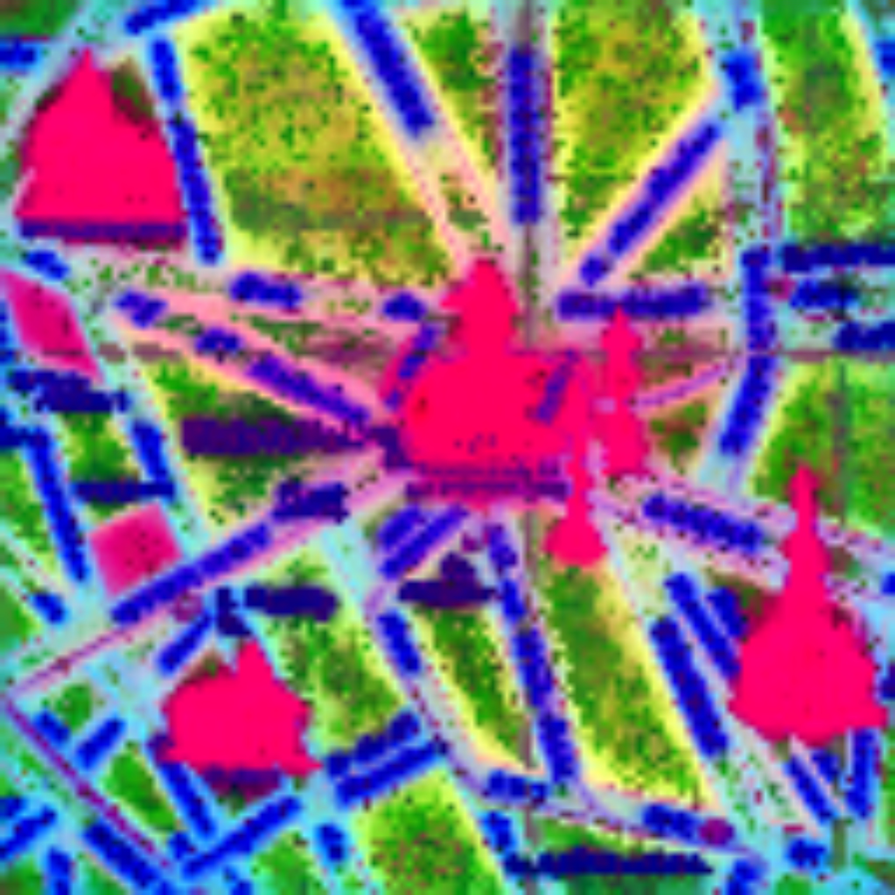

# 🗺️ Few-Shot Segmentation of Historical Maps via Linear Probing of Vision Foundation Models 

## 📄 Abstract [](https://arxiv.org/abs/2506.21826)

<div align="justify">
As rich sources of history, maps provide crucial insights into historical changes, yet their diverse visual representations and limited annotated data pose significant challenges for automated processing. We propose a simple yet effective approach for few-shot segmentation of historical maps, leveraging the rich semantic embeddings of large vision foundation models combined with parameter-efficient fine-tuning. Our method outperforms the state-of-the-art on the Siegfried benchmark dataset in vineyard and railway segmentation, <strong>achieving +5% and +13% relative improvements in mIoU in 10-shot scenarios and around +20% in the more challenging 5-shot setting.</strong> Additionally, it demonstrates <strong>strong performance on the ICDAR 2021 competition dataset, attaining a mean PQ of 67.3% for building block segmentation,</strong> despite not being optimized for this shape-sensitive metric, underscoring its generalizability. Notably, our approach maintains high performance even in extremely low-data regimes (10- & 5-shot), while <strong>requiring only 689k trainable parameters — just 0.21% of the total model size.</strong> Our approach enables precise segmentation of diverse historical maps while drastically reducing the need for manual annotations, advancing automated processing and analysis in the field.
</div>

<br>

<p align="center">
  
  
  <br>
  <em>Figure: An illustration of the first three principal components of RADIO-H feature embeddings of a map of Paris: despite no prior training in this specialized domain, meaningful classes have already emerged: landmarks, building blocks, streets, and street names are clearly distinguishable.</em>
</p>


---

## ⚙️ Methodology
The approach follows a three-stage adaptation process:

1. **🔍 Extract**: Extract image embeddings from a foundation model such as SAM, DINOv2, or RADIO.  
2. **📐 Upscale**: Rescale embeddings back to the original image resolution.  
3. **🎯 Classify**: Apply a linear pixel-wise classifier to obtain segmentation masks.  

---

## 💻 Usage

### ⭐ Ours (RADIO-L + DoRA)
```bash
python run.py --class_name $class_name --base_model radio_l --nshots 5 --scale_factor 3 --adapter dora --exp_name reproduce_ours
```

### 📊 Baselines (e.g., UNet)
```bash
python run.py --class_name $class_name --base_model unet --nshots 5 --epochs 100 --scale_factor 1 --exp_name reproduce_baseline
```

### 📚 Citation
```bash
@InProceedings{few-shot2025sterzinger,
      author="Sterzinger, Rafael and Peer, Marco and Sablatnig, Robert",
      title="Few-Shot Segmentation of Historical Maps via Linear Probing of Vision Foundation Models",
      booktitle="Document Analysis and Recognition -- ICDAR 2025",
      year="2026",
      pages="425--442"
}

```
